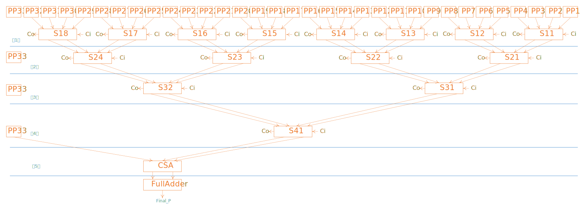
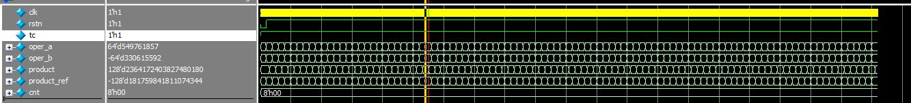
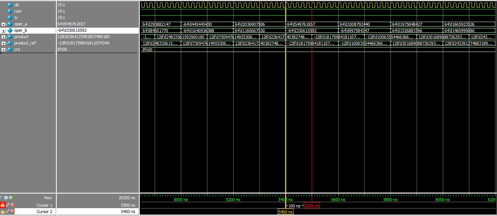
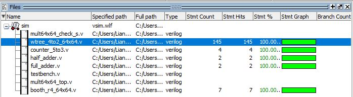
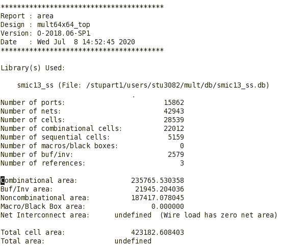
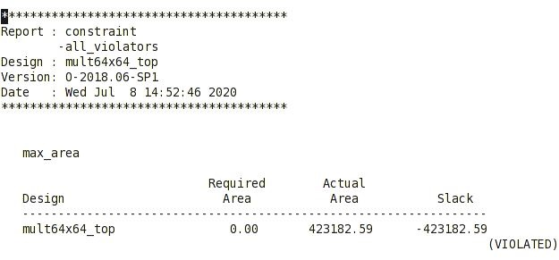
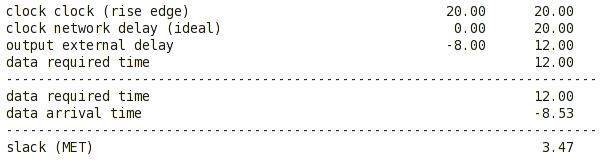
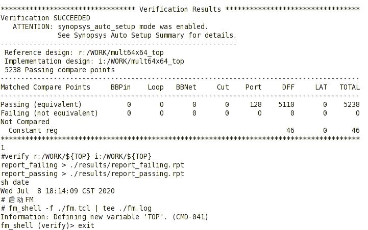
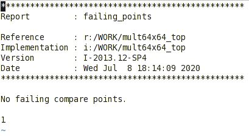
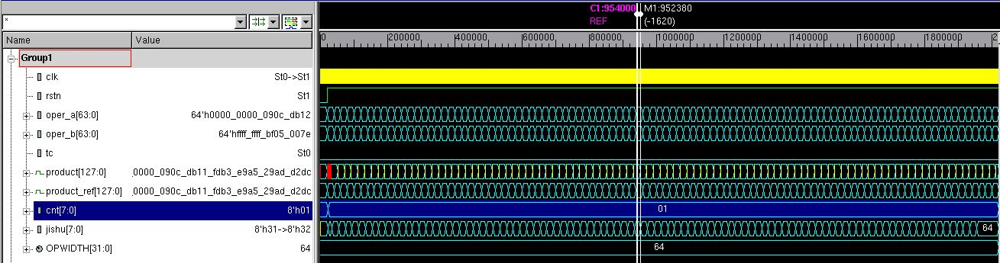

# EDA期末报告

## 64x64位算术乘法器设计

> 参考文章：https://zhuanlan.zhihu.com/p/127164011

#### 设计方案

先对乘数基于基4的Booth编码产生33个部分积，再经过基于4-2压缩的加法树处理，最后加上流水线设计，得到64x64乘法器的最终结果，并且该设计支持无符号和有符号数两种输入形式。

1. 设`[63:0]A`和`[63:0]B`是乘法器的两个输入，A为被乘数，B为乘数。

2. 对乘数B以基4的方式进行Booth编码，由于Booth编码是一种有符号数的编码方式，所以要在乘数B的最高位扩展一位`B[64]`兼容无符号数，另外在最低位的右边要扩展一个附加位`B[-1]`，其值为零；从最低位开始，3bit为一组，相邻组的最高位和最低位重合，即`B[1:-1]`为第一组，`B[3:1]`为第二组，依此类推，最后一组只有2bit，要在最高位再加一位`B[65]`，使之为3bit一组，总共分为33组：

   |     1      |     2      |     3      |     4      |     5      |     6      |
   | :--------: | :--------: | :--------: | :--------: | :--------: | :--------: |
   | `B[1:-1]`  |  `B[3:1]`  |  `B[5:3]`  |  `B[7:5]`  |  `B[9:7]`  | `B[11:9]`  |
   | `B[13:11]` | `B[15:13]` | `B[17:15]` | `B[19:17]` | `B[21:19]` | `B[23:21]` |
   | `B[25:23]` | `B[27:25]` | `B[29:27]` | `B[31:29]` | `B[33:31]` | `B[35:33]` |
   | `B[37:35]` | `B[39:37]` | `B[41:39]` | `B[43:41]` | `B[45:43]` | `B[47:45]` |
   | `B[49:45]` | `B[51:49]` | `B[53:51]` | `B[55:53]` | `B[57:55]` | `B[59:57]` |
   | `B[61:59]` | `B[63:61]` | `B[65:63]` |            |            |            |

3. 以上述的每组值对应基4Booth编码查找表（如下表所示），可以得到33个部分积PP1~PP33：

   | $x_{2i+1}$ | $x_{2i}$ | $x_{2i-1}$ | $PP_i$ |
   | :--------: | :------: | :--------: | :----: |
   |     0      |    0     |     0      |   0    |
   |     0      |    0     |     1      |   Y    |
   |     0      |    1     |     0      |   Y    |
   |     0      |    1     |     1      |   2Y   |
   |     1      |    0     |     0      |  -2Y   |
   |     1      |    0     |     1      |   -Y   |
   |     1      |    1     |     0      |   -Y   |
   |     1      |    1     |     1      |   0    |

4. 4-2压缩器有4个数据输入端和1个进位输入端，数据输入端接4个部分积相应的bit位，每个bit对应的进位输入端接其前1位的co输出，第0位的进位输入端接零值，无法加入到4-2压缩器输入的部份积保留到下一级，直到可以参与运算为止。注意两点：一是最终结果为128位，中间运算中凡是超出128位的数不进行计算，直接舍弃；二是自始至终必须保证数位对齐不能改变。对33个部分积基于4-2压缩器构建加法树，拓扑结构如下：

   

5. 具体的华莱士树分析见文件夹`.\doc\w_tree_analyse.xlsx`。

6. 在每一级加入流水线，提高工作频率。

#### 提交代码

```
src/
----mult64x64_top.v			// 工程顶层模块
----booth_r4_64x64.v		// 基4Booth编码
----wtree_4to2_64x64.v		// 基于4-2压缩器的华莱士树
----counter_5to3.v			// 4-2压缩器
----full_adder.v			// 全加器（CSA进位保留加法器）
----half_adder.v			// 半加器
tb/
----testbench.v				// 测试模块
----mult64x64_check_s.v		// testbench中有符号数参考模块
----mult64x64_check_us.v	// testbench中无符号数参考模块
```

## 前仿结果

1. `tc=1`表示有符号位相乘，`tc=0`表示无符号位相乘；

2. `cnt=0`表示计算结果与参考结果全部相同，`cnt`表示错误的次数；

3. 因为加入了五级流水线，所以输出相比输入延迟5个周期（clk_period=20ns）。





## 代码覆盖率

覆盖率报告见：`./results/coverage_report.txt`



## DC综合结果

```
results\
----mult.area_rpt
----mult.constraint_rpt
----mult.timing_rpt
```



----------------------



-------------------



## FM一致性检查结果

```
results\
----report_unmatched_points.rpt
----report_matched_points.rpt
----report_failing.rpt
----report_passing.rpt
```



-----------------------



## 后仿结果

1. `cnt=1`的原因是由于加了时序，存在输入输出延迟，设计输出一开始为不定态，而参考模块正常输出结果0，所以第一次初始化时结果不一致，后续结果都正确；
2. `jishu`是随机化仿真的次数；
3. `tc=0`表示仿真无符号数的乘积；
4. 图中所有数据皆为16进制；
5. 从图2中可以明显看到输出相对于时钟存在延迟，且输入输出延迟为5.9个周期左右。




